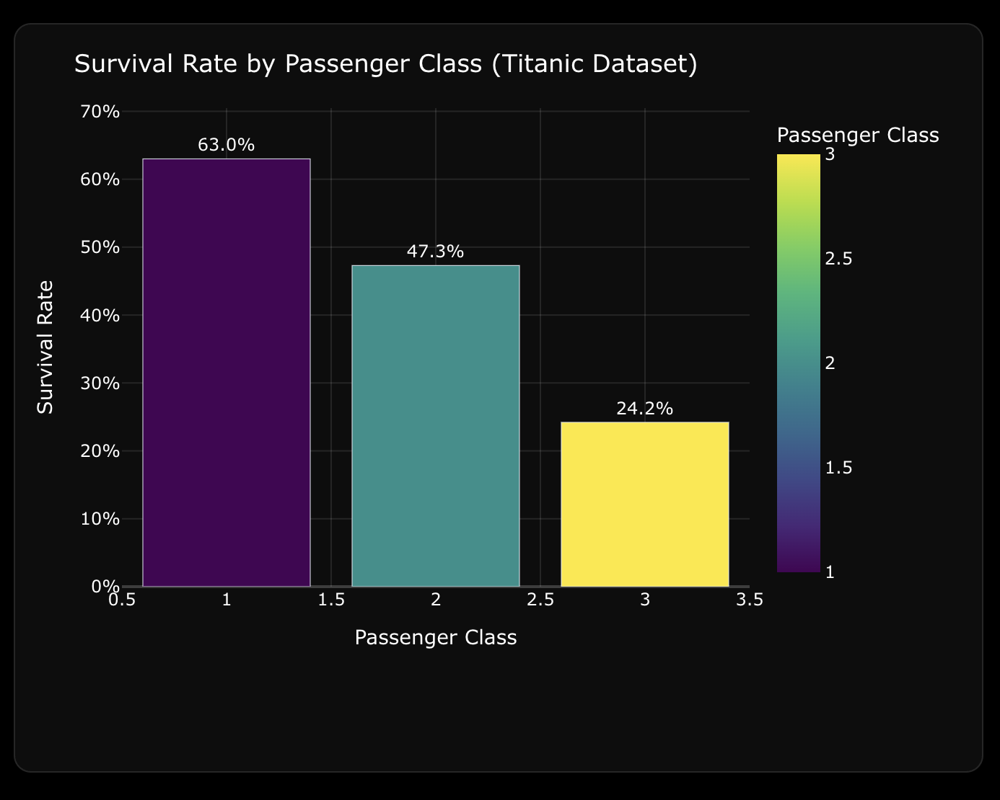
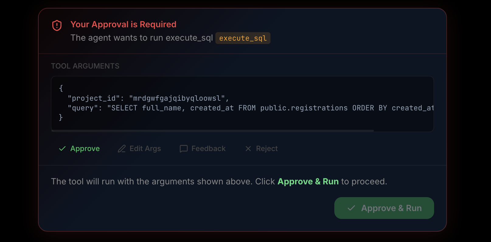
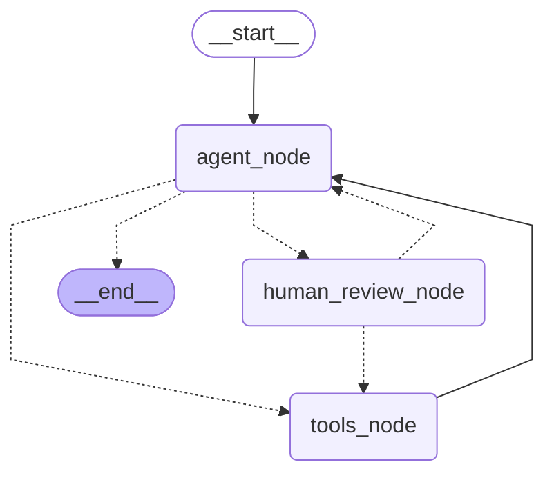

# Swift Agent

Swift Agent is a sophisticated AI data analyst and workflow agent powered by **LangGraph** and the **Model Context Protocol (MCP)**. It is designed to be a versatile assistant capable of ingesting raw data, executing complex analytical tasks, managing projects, and interacting with databases—all while maintaining a strict safety layer through a human-in-the-loop (HITL) approval system.

## Key Capabilities

- **Automated Data Analysis**: Upload CSV or Excel files directly in the chat. The agent automatically parses the data using Pandas, provisions a table in a Postgres database, and loads the data for full SQL querying power.
- **Dynamic Visualization**: The agent writes and executes Python code to generate Plotly visualizations, which are instantly rendered interactively on the Next.js frontend.
- **Database Management**: Full capability to read schemas, execute complex SQL queries, apply migrations, and manage database state securely.
- **Project Lifecycle Management**: Tools for creating, pausing, and deleting projects (e.g., Supabase integration).
- **Human-in-the-Loop (HITL)**: Sensitive operations (Protected Tools) require explicit user approval. Users can approve, update arguments, provide feedback, or reject actions before they execute.
- **Export Chat**: Export your entire conversation history—including interactive Plotly graphics—into a cleanly formatted PDF document with a single click.
- **Robust Model Fallbacks**: Configured with LangChain fallbacks to seamlessly switch to an alternate LLM (maintaining full tool-calling capabilities) if the primary model encounters API issues or timeouts.
- **Observability**: Full tracing and debugging support out of the box via **LangSmith**.

## Visual Demos

### Interactive Plotly Visualizations


### Human-in-the-Loop Interrupts


## Architecture

The agent is implemented as a state machine using LangGraph:

1. **`agent_node`**: The core LLM (via Groq/GPT) that evaluates the user's request and decides which tools to call.
2. **`human_review_node`**: A safety gate that intercepts "Protected Tools." It pauses execution using LangGraph's `interrupt` mechanism until a human provides a decision.
3. **`tools_node`**: A specialized node that executes all approved and safe tool calls in parallel.

### Execution Graph



### Protected Tools
The following tools are marked as protected and will always trigger a human review:
- `create_project`
- `delete_project`
- `execute_sql`
- `apply_migration`

## Tech Stack

- **Orchestration**: LangGraph
- **API & Routing**: FastAPI
- **Tooling**: Model Context Protocol (MCP)
- **Data Processing**: Pandas, openpyxl
- **Visualization**: Plotly, react-plotly.js
- **Frontend**: Next.js, Tailwind CSS, Framer Motion
- **Package Management**: uv

## Getting Started

### Prerequisites
- Python 3.12+
- [uv](https://github.com/astral-sh/uv)
- Node.js & npm (for the frontend)
- API Keys (Groq/OpenAI, LangSmith, Supabase, etc.)

### Backend Setup

1. **Clone the Repository**
   ```bash
   git clone <your-repo-url>
   cd swift-agent
   ```

2. **Environment Setup**
   ```bash
   uv venv
   uv sync
   uv pip install -e .
   ```

3. **Configuration**
   Create a `.env` file in the root directory:
   ```env
   GROQ_API_KEY=your_api_key_here
   SUPABASE_DB_URI=your_postgres_connection_string
   LANGSMITH_TRACING=true
   LANGSMITH_API_KEY=your_langsmith_key
   ```

4. **Running the Agent**
   Use the LangGraph CLI for a local development server with studio access:
   ```bash
   langgraph dev
   ```

### Frontend Setup

1. Navigate to the frontend directory:
   ```bash
   cd frontend
   npm install
   ```
2. Start the development server:
   ```bash
   npm run dev
   ```
3. Open `http://localhost:3000` to interact with the agent.
